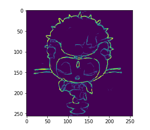

# Edge Detector

A deep-learning program to detect the edges of an image.

## Dependancies

You will need the following python packkages:

* boto3==1.4.4
* imutils==0.4.2
* Keras==2.0.3
* scipy==0.19.0
* scikit_image==0.13.0
* numpy==1.12.1
* matplotlib==2.0.0
* botocore==1.5.42
* cv2==1.0

## Running the tests

You will need to fork and clone my repository and install the above dependancies to get started.
Rewrite the `TOY.jpg` under the images directory with your required image.
Run the [edge_notebook.ipynb](edge_notebook.ipynb) file in your jupyter notebook and get started.:)

### My example

## Acknowledgments

* Coursera- Deep Learning specilization courses, Deeplearning.ai by Andrew Ng.
* Blog posts
